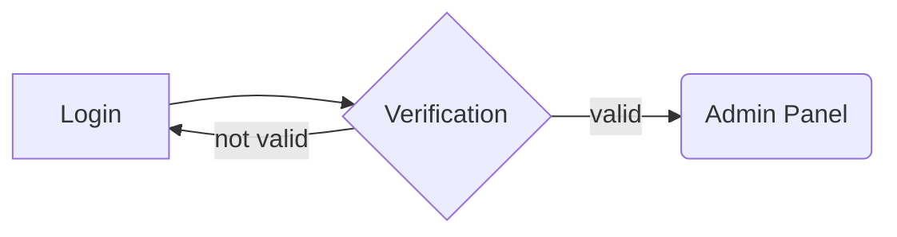

# Sistem Informasi Management Produk

## Tentang project ini

Project ini adalah aplikasi berbasis web yang dikembangkan menggunakan PHP dengan framework CodeIgniter 4 (versi 4.6.0) dan database PostgreSQL. Aplikasi ini dirancang untuk mengelola data produk dengan fitur utama seperti login pengguna menggunakan autentikasi JWT (JSON Web Token), CRUD (Create, Read, Update, Delete) untuk produk, serta profil pengguna. Frontend menggunakan controller khusus untuk view dengan styling berbasis Tailwind CSS dan notifikasi melalui Toastr. Sistem login memungkinkan pengguna untuk mengakses fitur setelah autentikasi, sementara fitur CRUD dilengkapi dengan API yang mengembalikan data dalam format JSON, mendukung pengelolaan produk termasuk kategori, harga, stok, dan unggahan gambar. Fitur logout telah diimplementasikan dengan mekanisme penghapusan token lokal dan penambahan ke blacklist di server untuk keamanan. Aplikasi ini juga mencakup validasi data, perhitungan otomatis harga jual (30% dari harga beli), dan tampilan responsif, menjadikannya solusi terpadu untuk manajemen inventaris dengan antarmuka yang modern dan fungsional.
  
## Setup

Create `.env` to root project and tailor for your app, specifically the baseURL and any database (PostgreSQL) settings.

For init database `php spark migrate`
and dump seeds `php spark db:seed` check `Database/Seeds` to see user account

## Installation & updates

To install dependencies `composer install` or update with `composer update`

When updating, check the release notes to see if there are any changes you might need to apply to your `app` folder. The affected files can be copied or merged from

`vendor/codeigniter4/framework/app`.

## Server Requirements

PHP version 8.1 or higher is required, with the following extensions installed:

- [intl](http://php.net/manual/en/intl.requirements.php)
- [mbstring](http://php.net/manual/en/mbstring.installation.php)

## Login flowchart
